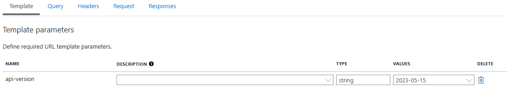
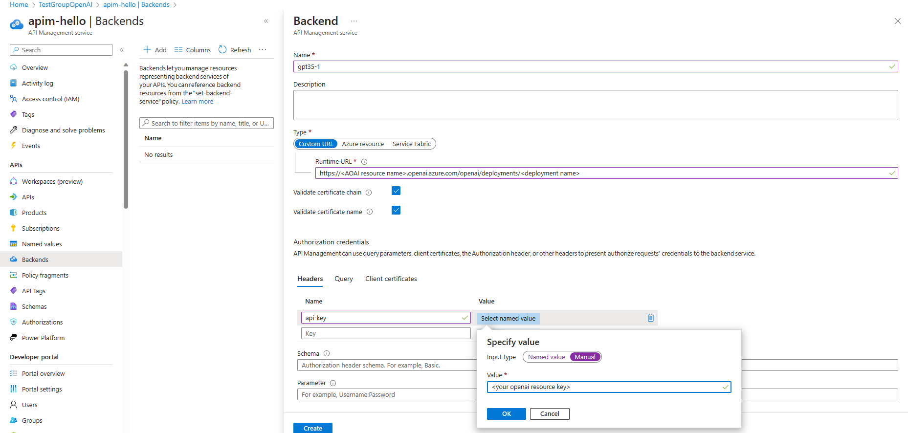
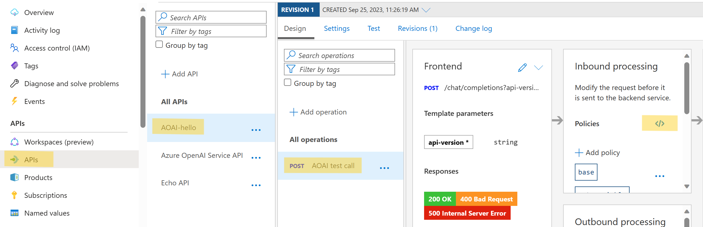
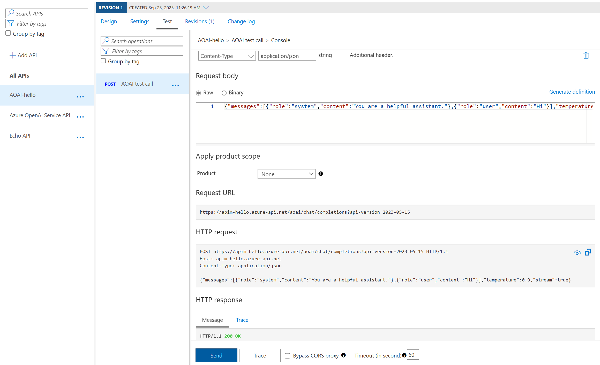

# Rate Limit 与资源管理

如果 Azure OpenAI 用户发现单一资源的 TPM (Token Per Minute) 无法满足需求，可以通过创建多个 AOAI 资源，并使用 Azure API Management 管理多个终结点，将工作负载分散到多个资源中，从而提高整体 TPM。在 APIM 中，我们可以使用轮询或其他负载均衡算法定义路由规则将请求动态路由到不同的终结点，还可以根据 APIM 监控结果，适时调整资源分配和负载均衡策略。

以下是具体的实现步骤。

## 创建多个 AOAI 资源
1. 创建多个 AOAI 资源，以两个为例
  
2. 在 AOAI 资源概览页面，获取相应的 Endpoint, Key
  

## 创建 API 管理服务
1. 在 Azure 门户中选择 **创建资源**，搜索 **API Management** 并点击 **Create**
  
2. 在 **创建 API 管理** 页，输入以下设置
  - **Region:** 从可用的 API 管理服务位置选择
  - **Resource name:** API 管理服务的名称，需全球唯一，创建后不能更改
  - **Administrator email:** 填入您自己的邮箱，APIM 服务创建完成之后将发邮件通知
  - **Organization name:** 填入您或组织的名称，通知邮件的标题中将使用此名称
  - **Pricing tier:** 选择 Developer
  
3. 点击 **Review + Create**

## 导入 API
1. 导航到 API 管理实例，选择 **APIs** -> **Add API** -> **HTTP** API
  
2. 在 **创建 HTTP API** 窗口中，选择 **Full**
  - **Products:** 选择 Unlimited
  - **Gateways:** 选择 Managed
  
3. 点击 **Create**

## 向 HTTP API 添加操作
1. 选择上一步中创建的API，点击 **Add Operation** -> **Frontend** 添加操作
  - **Display name：** 显示在开发人员门户中的名称
  - **URL:** 方法选择 POST，路径填入 ```/chat/completions?api-version={api-version}```
  
2. 继续在 **Frontend** 中选择 **Response** 添加响应
  - 200 OK
  - 400 Bad Request
  - 500 Internal Server Error
3. 在当前窗口的 **Representation** 下添加 API 请求的表现形式
  - **Content Type:**
    ```
    application/json
    ```
  - **Sample:**  
    ```
    {"messages":[{"role":"system","content":"You are a helpful assistant."},{"role":"user","content":"Hi"}],"temperature":0.9,"stream":true}
    ```
  - **Definition:**
    ```
    ChatCompletionsPostRequest-1
    ```
  
4. 最后在 **Template** 中填入 API version
  

## 使用 APIM 管理多个 AOAI 终结点
1. 在API 管理左侧选项卡选择 **Backends** -> **Add**，创建名为 ```gpt35-1``` 和 ```gpt35-2``` 两个后端
  - 选择自定义 URL，并填入
  ```
  # 替换为相应的值 
  https://<your OpenAI resource name>.openai.azure.com/openai/deployments/<your deployment id>
  ```  
2. 添加名为 ```api-key``` 的 Header，Value 填入相应的 AOAI Key
   
3. 打开 **API** -> **POST** -> **Policies**
  
4. 将 **Policies** 中的内容全部替换为：
```
<policies>
    <inbound>
        <base />
        <set-variable name="msgId" value="@{
            // 从 HTTP 请求头中获取 MsgId 值
            int msgId = 0;
            if (context.Request.Headers.TryGetValue("MsgId", out var msgIdValues) && msgIdValues.Any())
            {
                int.TryParse(msgIdValues.First(), out msgId);
            }
            return msgId % 2;
        }" />

        <!-- 根据 msgId 的值选择后端服务 -->
        <choose>
            <when condition="@((int)context.Variables["msgId"] == 0)">
                <!-- 当 msgId 为偶数时，使用 gpt35-1 作为后端服务 --> 
                <set-backend-service backend-id="gpt35-1" />
            </when>
            <otherwise>
                <!-- 当 msgId 为奇数时，使用 gpt35-2 作为后端服务 -->
                <set-backend-service backend-id="gpt35-2" />
            </otherwise>
        </choose>

         <!-- 允许跨域请求 -->
        <cors allow-credentials="false">

            <!-- 允许所有来源 -->
            <allowed-origins>
                <origin>*</origin>
            </allowed-origins>

            <!-- 允许 GET 和 POST 请求 --> 
            <allowed-methods>
                <method>GET</method>
                <method>POST</method>
            </allowed-methods>
        </cors>
    </inbound>
    <backend>
        <base />
    </backend>
    <outbound>
        <base />

         <!-- 设置响应头 Access-Control-Allow-Origin -->
        <set-header name="Access-Control-Allow-Origin" exists-action="override">
            <value>*</value>
        </set-header>        
    </outbound>
    <on-error>
        <base />
    </on-error>
</policies>
```
- 如果有多个backend, 修改 "2" 为相应的数量，并按条件增加路由项
5. 测试
  - 切换到 **Test** 页
  - 点击最下方 **Send** 按钮
  - HTTP 响应状态为 *200 OK* 则测试成功
  
